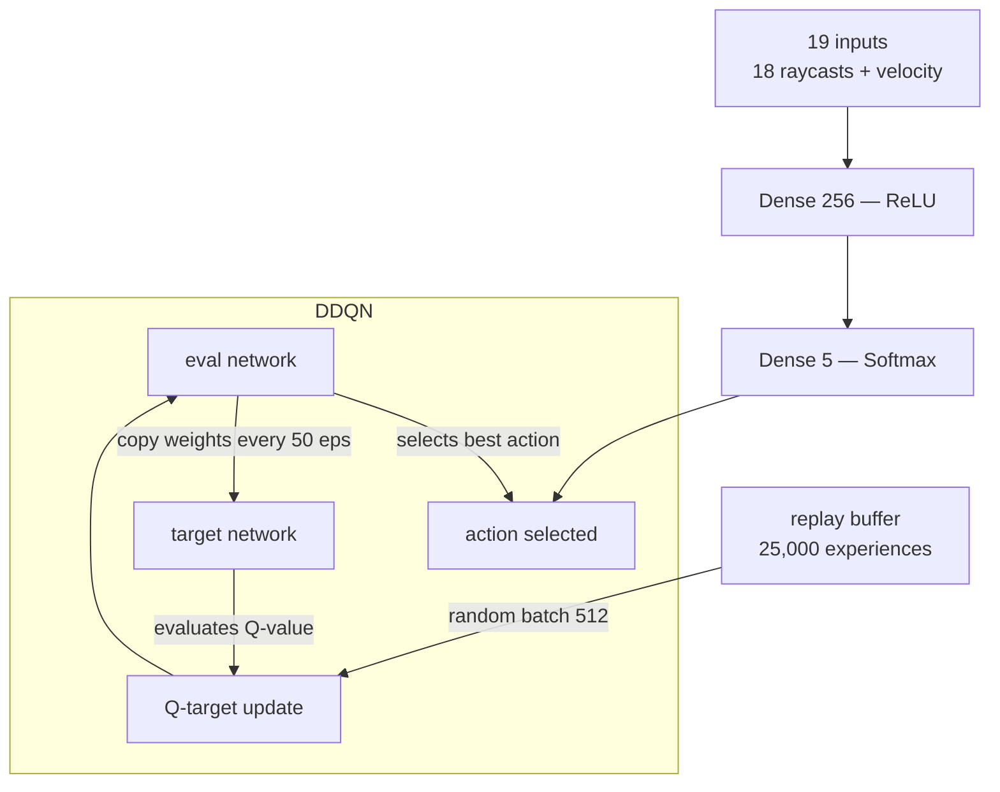

<h1 align="center">selfracer</h1>

<p align="center">
  <strong>a car that learns to drive itself using Double Deep Q-Learning.</strong><br/>
  18 raycasts. 5 actions. 10,000 episodes. built from scratch in first year of college.
</p>

<p align="center">
  <a href="#the-experiment">the experiment</a> &middot;
  <a href="#running-it">running it</a> &middot;
  <a href="#how-it-works">how it works</a> &middot;
  <a href="#architecture">architecture</a> &middot;
  <a href="#what-i-learned">what i learned</a>
</p>

---

## The Experiment

first year of college. just learned about reinforcement learning and DDQN.  
wanted to test: *can a neural network learn to drive a car purely from raycasts and rewards?*

no simulation engines. no pre-built environments. no gym.  
built the track, the car physics, the raycasting, the collision detection, and the agent — all from scratch using pygame and keras.

after ~10,000 episodes — it drives.

---

## Demo

| training (early) | training (late) |
|---|---|
| car crashes into every wall | car navigates the full track cleanly |

[![Watch the Video]](assets/VSR CAR Demo.mp4.mp4)

---

## Running It

> model weights (`ddqn_model.h5`) are not included in this repo.  
> train your own using `main.py`, or reach out — i'll share the weights directly.

```bash
git clone https://github.com/vijaysairaj/selfracer
cd selfracer
pip install -r requirements.txt
python main.py
```

to watch a trained model drive:

```bash
python main_test_model.py
```

---

## How It Works

```
18 raycasts + velocity  →  DDQN picks action  →  car moves
        ↑                                               ↓
  network trains                              reward or penalty
        ↑                                               ↓
  replay buffer  ←─────────── experience stored ───────┘
```

### What the Car Sees

18 rays cast in all directions — forward, sides, diagonals, corners.  
each ray measures distance to the nearest wall, normalized between 0 and 1.  
plus current velocity as the 19th input.

```
input_dims = 19
```

### What the Car Can Do

| action | behaviour |
|--------|-----------|
| 0 | do nothing |
| 1 | accelerate forward |
| 2 | turn left |
| 3 | turn right |
| 4 | reverse |
| 5–8 | diagonal combos |

```
n_actions = 5
```

### Reward Structure

| event | reward |
|-------|--------|
| crossing a checkpoint | +1 |
| hitting a wall | −1 + episode ends |
| alive, no event | 0 |

---

## Architecture



### Why DDQN over DQN

standard DQN overestimates Q-values — the same network selects and evaluates actions.  
DDQN fixes this by splitting the two:

```
Q-target = reward + gamma * Q_target(s', argmax Q_eval(s'))
```

target network weights sync every `50` episodes — stable enough to learn from, fresh enough to improve.

### Training Config

| parameter | value |
|-----------|-------|
| episodes | 10,000 |
| max ticks per episode | 1,000 |
| learning rate | 0.0005 |
| gamma | 0.99 |
| epsilon start | 1.00 |
| epsilon end | 0.10 |
| epsilon decay | 0.9995 |
| batch size | 512 |
| replay buffer | 25,000 |
| target network update | every 50 eps |

---

## Project Structure

```
selfracer/
├── main.py               # training loop — 10,000 episodes
├── main_test_model.py    # load weights and watch it drive
├── GameEnv.py            # environment — car physics, raycasts, collision, rewards
├── ddqn_keras.py         # DDQN agent, replay buffer, neural networks
├── Walls.py              # track boundary definitions
├── Goals.py              # checkpoint definitions
├── Track1.png            # track image
├── car.png               # car sprite
├── requirements.txt
├── assets/
│   └── demo.gif
├── .gitignore
├── LICENSE
└── README.md
```

---

## Tech Stack

| | |
|---|---|
| **environment** | pygame — custom physics, raycasting, collision |
| **agent** | Double Deep Q-Network (DDQN) |
| **neural network** | Keras + TensorFlow |
| **replay buffer** | numpy circular buffer |

---

## What I Learned

- building the environment from scratch taught more than any library would have
- DDQN's separated eval/target networks visibly reduce training instability
- epsilon decay rate is everything — too fast and it exploits bad early policies
- the car learns to hug checkpoints optimally, not just avoid walls — emergent behaviour
- raycast normalization matters more than network depth at this scale
- this was first-year college. if i rebuilt this today it would look very different.

---

## Open Questions

- would a continuous action space produce smoother driving than discrete?
- how does it generalise to a different track it hasn't seen?
- worth testing PPO or SAC on the same custom environment?

---

## Built In

2023 — first year of college, right after learning DDQN from scratch.

---

## License

MIT — use it, fork it, build on it.

---

*built by [vijay sai raj](https://github.com/vijaysairaj)*
